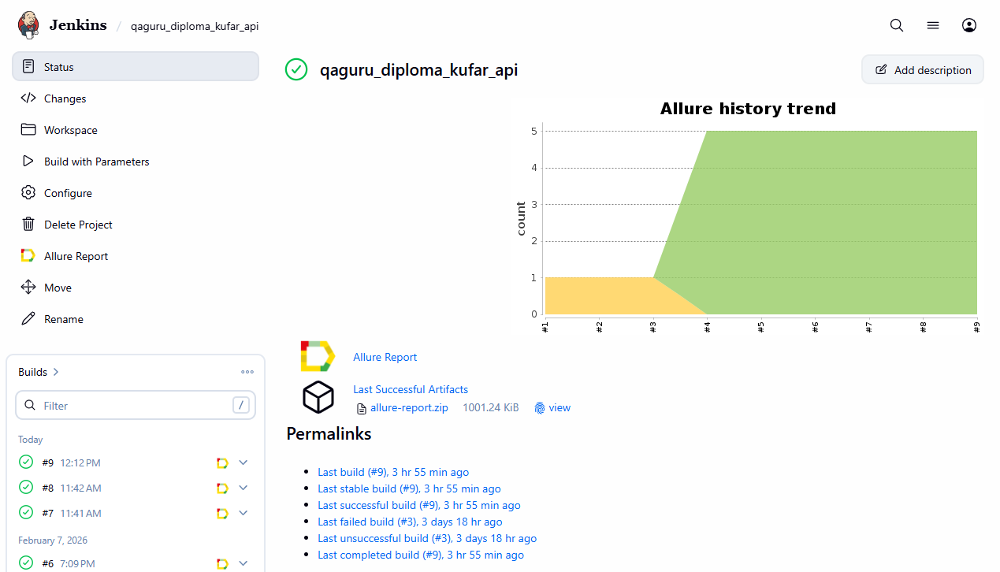
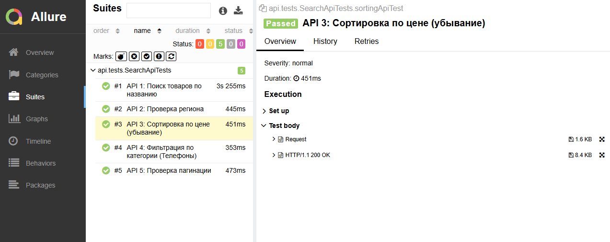
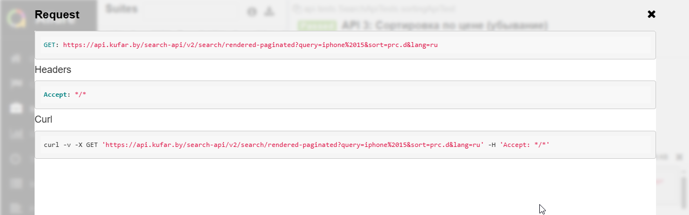
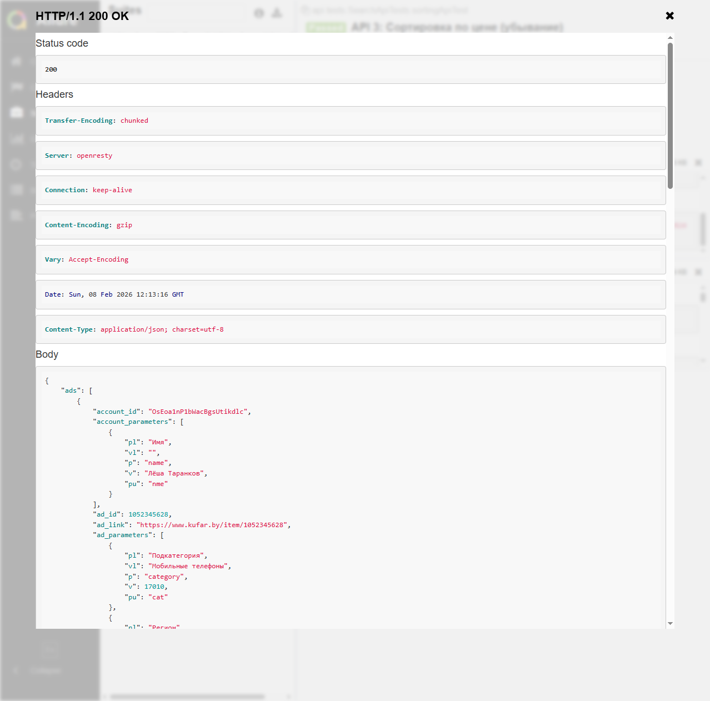
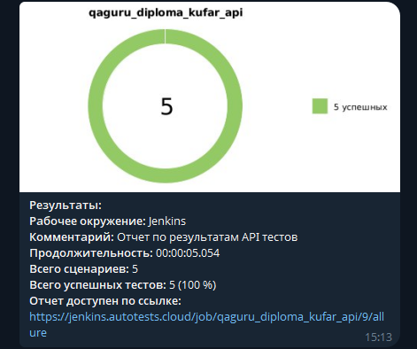

# Проект по автоматизации API-тестирования для онлайн-площадки объявлений [Kufar](https://www.kufar.by/l) 

>Куфар (Kufar) — это крупнейшая в Беларуси онлайн-площадка объявлений, где пользователи покупают и продают новые и б/у товары, недвижимость, автомобили, а также предлагают услуги. Ежемесячно сайт посещают более 5 миллионов пользователей.

## 🧾 Содержание

- [Описание проекта](#-описание-проекта)
- [Стек технологий](#-стек-технологий)
- [Реализованные проверки](#-реализованные-проверки)
- [Инфраструктура](#-инфраструктура)
- [Результаты визуализации](#-результаты-визуализации-примеры)

## 📌 Описание проекта

В данном проекте реализована автоматизация тестирования серверной части (Backend) площадки **Kufar**. Основной фокус сделан на проверку стабильности эндпоинтов, валидацию схем ответов и логику взаимодействия между сервисами.

## 🛠 Стек технологий

   
  
  
   
   
   
   
    
    
   
   

-  **Язык:** Java  
-  **Библиотека для API:** REST Assured  
-  **Сериализация/Десериализация:** Jackson, Lombok (модели данных)  
-  **Валидация:** JSON Schema Validation  
-  **Тестовый запуск:** JUnit 5  
-  **CI/CD:** Jenkins  
-  **Отчеты:** Allure Report  
-  **Уведомления:** Telegram Bot  

## ✅ Реализованные проверки

-  Поиск товаров по названию.
-  Проверка региона.  
-  Сортировка по цене (убывание).  
-  Фильтрация по категории (Телефоны).  
-  Проверка пагинации.

## 🏗 Инфраструктура

### 1. Локальный запуск тестов
   
Тесты запускаются с помощью Gradle. Для локального запуска:  

`gradle clean test`

### 2. Удаленный запуск в Jenkins
Сборка настроена в **Jenkins**.

## 📊 Отчетность и мониторинг

### Allure Report (API Details)

В отличие от UI-тестов, здесь Allure используется для отображения структуры запросов. Благодаря фильтру `AllureRestAssured`, в отчетах доступны:  
-  URL и метод запроса (GET/POST/etc).  
-  Headers и Cookies.  
-  Тело запроса (Body).  
-  Форматированный JSON-ответ сервера. 

### Уведомления в Telegram

Бот присылает мгновенный статус прохождения API-тестов. Если сервис начнет отдавать 500 ошибку, уведомление придет сразу после завершения билда.

